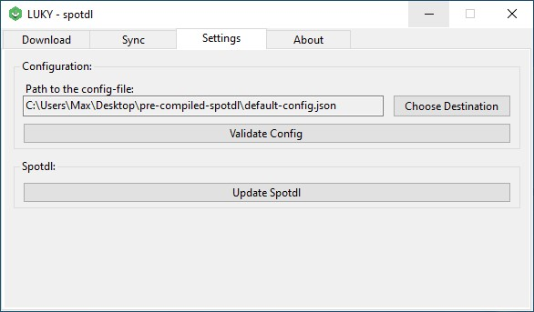

# LUKYS-spotdl
A selfmade [spotdl](https://github.com/spotDL/spotify-downloader) graphical user interface.

## Features
- Download Playlists
- Synchronize already downloaded Playlists

## Download pre-compiled Windows-zip
[Direct Download (latest Version)](https://github.com/MonsterSchool/LUKYS-spotdl/releases/latest/download/pre-compiled-spotdl.zip)

## Screenshots

## How to use
1. Download python
2. Download spotdl
3. Download FFmpeg
4. Download this (LUKYS-spotdl)

Start with Downloading a new Playlist to a specified folder. You need to add the cookies.txt-File from YouTube-Music!
From then you can synchronize your downloaded playlists (for example if you've added new songs to the spotify-playlist).

## Copyright
The contents and works in this software created by the software operators are subject to German copyright law. The reproduction, editing, distribution and any kind of use outside the limits of copyright law require the written consent of the respective author or creator. Downloads and copies of this software are only permitted for private, non-commercial use.

Insofar as the content on this software was not created by the operator, the copyrights of third parties are observed. In particular, third-party content is identified as such. Should you nevertheless become aware of a copyright infringement, please inform us accordingly. If we become aware of any infringements, we will remove such contents immediately.

Source: [eRecht24.de](https://www.e-recht24.de/)
