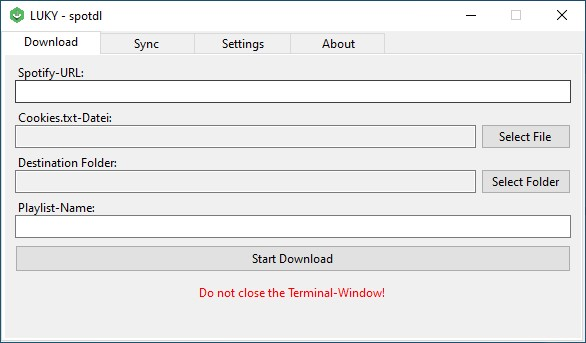

# LUKYS-spotdl
A selfmade [spotdl](https://github.com/spotDL/spotify-downloader) graphical user interface.

## Features
- Download Playlists
- Synchronize already downloaded Playlists

## Download pre-compiled Windows-zip
[Direct Download]([https://github.com/spotDL/spotify-downloader](https://github.com/MonsterSchool/LUKYS-spotdl/releases/download/v.03.20.24/pre-compiled-lukys-spotdl.zip )https://github.com/MonsterSchool/LUKYS-spotdl/releases/download/v.03.20.24/pre-compiled-lukys-spotdl.zip )

## Screenshots

